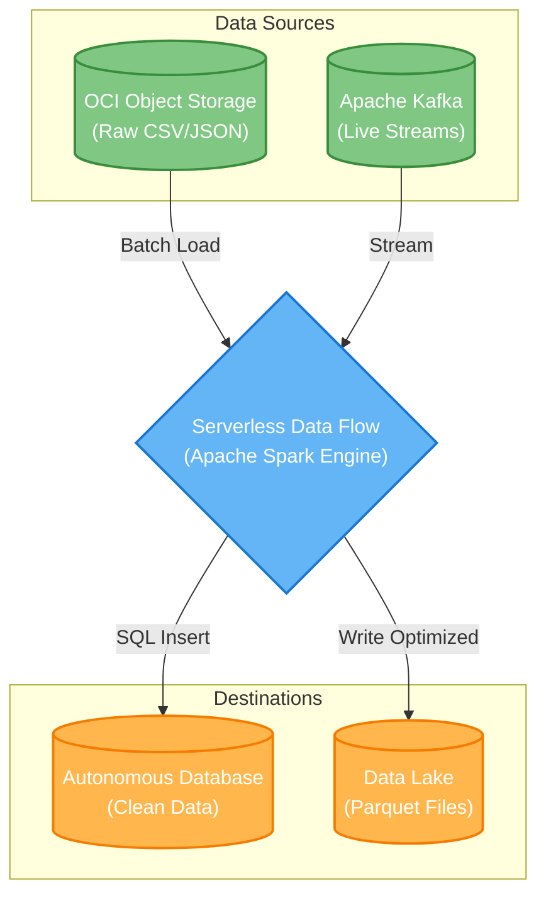

#  OCI-DataFlow-Showcase: Serverless Big Data

Welcome to the **OCI-DataFlow-Showcase**! 

I put together this repository to demonstrate how to easily run massive Apache Spark jobs in the cloud without ever having to touch a server, configure a cluster, or manage complicated infrastructure. 

Using **Oracle Cloud Infrastructure (OCI) Data Flow**, you can simply write your data processing logic, submit it, and let the cloud handle the scaling. 

##  The Architecture

To make it easy to visualize, here is a diagram of the typical big data pipeline demonstrated in these examples:

##  What's Inside?

This repo contains ready-to-run examples in Python, Java, and Scala for common big data tasks:
- **Format Conversion**: Convert massive, messy CSV files into lightning-fast Parquet formats.
- **Data Warehousing**: Read raw data, transform it, and load it securely into an Autonomous Database.
- **Real-time Streaming**: Connect to Kafka streams to process events live as they happen.
- **Machine Learning**: Train Random Forest regression models at scale.

##  Why I Love This Approach
The beauty of Data Flow is that everything is completely driven by REST APIs. You can easily integrate these jobs into your existing web apps or automated workflows, making Big Data processing feel just like calling a standard web endpoint!
