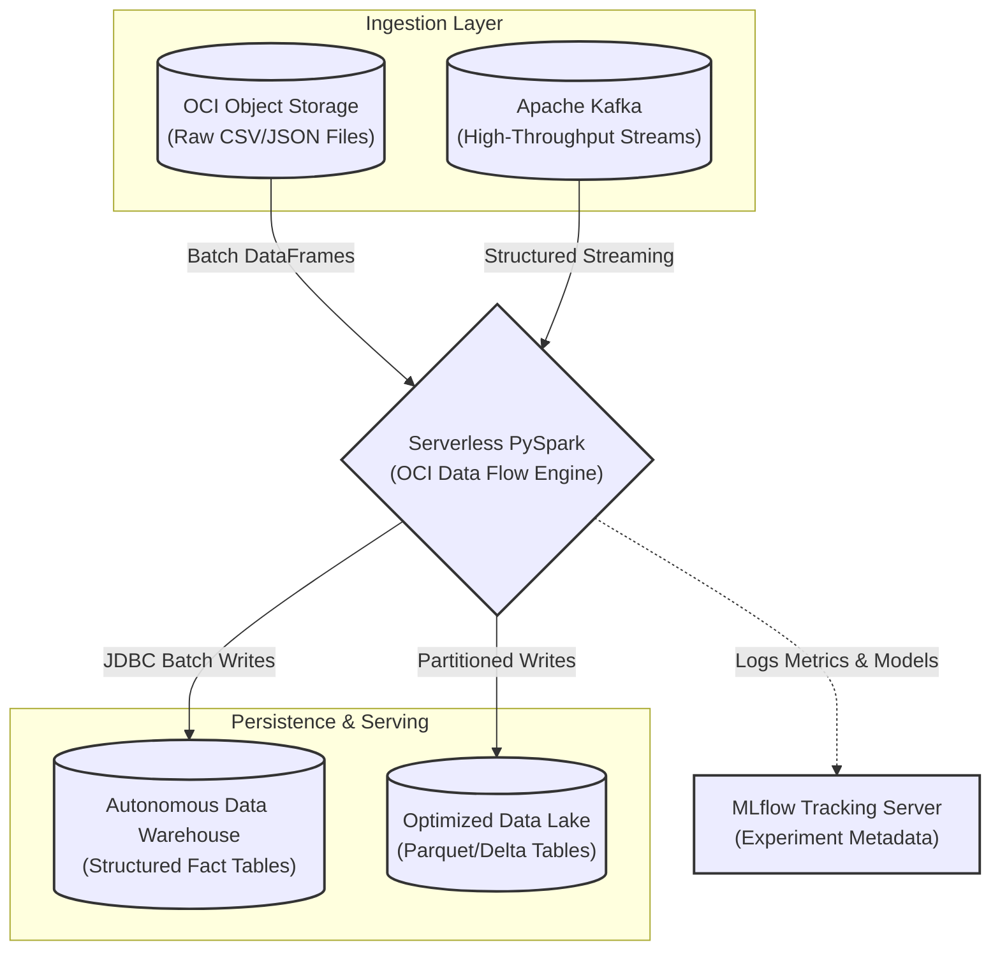

# OCI-DataFlow-Showcase: Serverless Big Data Workloads

Welcome to the OCI-DataFlow-Showcase repository. 

This project demonstrates how to orchestrate and execute Apache Spark applications at massive scale using Oracle Cloud Infrastructure (OCI) Data Flow. OCI Data Flow provides a fully managed, serverless Spark environment, eliminating the operational overhead of provisioning, configuring, and tuning Hadoop or Kubernetes clusters.

## Architecture and Data Pipelines

The repository provides concrete implementations of typical Big Data architectures, showcasing batch ETL, real-time stream processing, and machine learning model training.

## Technical Demonstrations Included

This repository contains robust examples written across Python, Java, and Scala to interface with the Data Flow REST APIs and execute specific workloads:

1. **Format Conversion (ETL)**: Scripts utilizing PySpark DataFrames to ingest large-scale unstructured CSV data from Object Storage, infer schemas, and write highly compressed, columnar Apache Parquet files back to the object store.
2. **Data Warehousing Integration**: Demonstrates configuring the Spark engine to authenticate and establish high-speed JDBC connections with an Autonomous Data Warehouse (ADW) to execute massive bulk-inserts.
3. **Structured Streaming**: Shows how to maintain a persistent connection to an Apache Kafka topic to consume continuous data streams. It features windowed aggregations (e.g., calculating moving averages over a one-minute sliding window).
4. **Distributed Machine Learning**: Features a Random Forest Regression implementation using `pyspark.ml`. It distributes the model training across the serverless nodes and logs hyperparameters and artifacts to a connected MLflow Tracking Server.

## Execution Model
OCI Data Flow applications are entirely driven by REST APIs. You package your application code (and any dependencies), upload it to Object Storage, and trigger a run via the OCI CLI, SDKs, or the web console. The infrastructure automatically provisions the requested executor nodes, runs the Spark context, and tears down the environment upon completion, ensuring you only pay for the exact compute time consumed.
